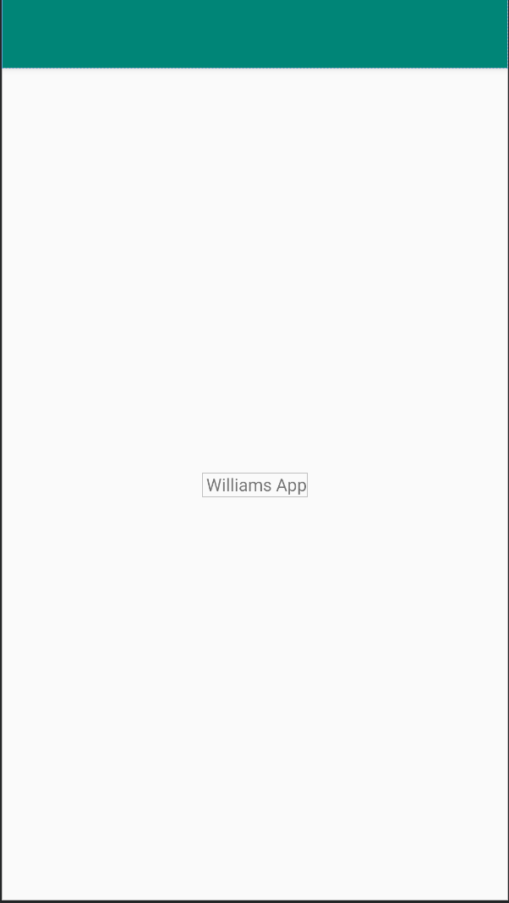

# Rapport

**Skriv din rapport här!**

För att kunna starta med uppgiften krävdes det först att ett konto på github skapades med samma namn som högskolekontots namn,
Sedan behövdes två program laddas ner, git och android studio. I uppgiftsbeksrivningen finns en länk till github-sidan som ska användas i uppgiften.
För att använda materialet från github-sidan måste en fork göras och sedan klonas till android studio. 
För att ändra värdet från "Hello" behöver man navigera sig till strings.xml genom app/res/value/strings.xml. I filen ändras värdet på en string från "Hello" till "Williams App"!

```
<resources>
    <string name="app_name"> Williams App</string>
</resources>
```
Koden där texten Williams App skrivs ut



Bild på layouten 